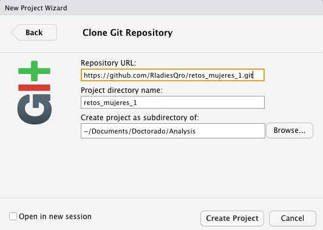

# Retos 1

## Presentación

- ¿Quiénes son principiantes? ¿Quiénes saben usar ggplot?

- Intercalar

- Posticks 

## Retos 1: Base de datos de mujeres 

### *Objetivo:*

Usar bases de datos con información de mujeres: 

- Base de datos de Rladies

- Base de datos de mujeres profesionistas

- *Base de datos mexicana (si da tiempo)*


## Primera base de datos | Eventos de Rladies {.build}

<div class="liga">
 https://github.com/cienciadedatos/datos-de-miercoles/blob/master/datos/2019/2019-06-26/README.md
</div>

- Base de datos creada para usarse en *datos-de-miercoles* (26/06/2019).

<div class="text">

"Datos de miércoles es el primo latinoamericano de #tidytuesday, un proyecto semanal de datos organizado por la comunidad de R, que busca que sus participantes desarrollen sus habilidades procesando datos para crear gráficos significativos usando ggplot2, tidyr, dplyr y otras herramientas del tidyverse. El proyecto original surgió en el marco de la comunidad de aprendizaje online R4DS y desde abril de 2019 la comunidad sudamericana de R impulsa una versión local en español" 

</div>

## Github {.build}

<div class="liga2">
https://github.com/RladiesQro/retos_mujeres_1
</div>

```{r echo=FALSE, fig.align="center", out.width="600px"}

```

---

### Clonar el repositorio {.build}

- Primer paso

```{r echo=FALSE, fig.align="center", out.width="400px"}
knitr::include_graphics("images/sc_git1.png")
```

- Segundo paso

```{r echo=FALSE, fig.align="center", out.width="400px"}

```

---

- Tercer paso 

```{r echo=FALSE, fig.align="center", out.width="400px"}

```

- Cuarto paso 
```{r echo=FALSE, fig.align="center", out.width="400px"}

```


---

## Rmarkdown

Aza

---


## Descargar los datos {.build} 


``` {r}
# install_packages("readr")
library(readr)
```

- Infromación de los capitulos de Rladies

``` {r}
capitulos_rladies <- readr::read_csv("https://raw.githubusercontent.com/cienciadedatos/datos-de-miercoles/master/datos/2019/2019-06-26/capitulos_rladies.csv")
```


--- 

## {.smaller} 

``` {r}
head(capitulos_rladies)
```


---

- Infromación de los eventos de Rladies

``` {r}
eventos_rladies <- readr::read_csv("https://raw.githubusercontent.com/cienciadedatos/datos-de-miercoles/master/datos/2019/2019-06-26/eventos_rladies.csv")
```

---
## {.smaller} 

``` {r}
head(eventos_rladies)
```

---

## Rmarkdown

Aza

---

## Mapa 

¿Dondé se encuentran los capitulos de Rladies?


``` {r}
#install.packages(c("ggplot2","maps"))
library(ggplot2)
library(maps)
```


``` {r}
world <- map_data("world")
head(world)
```

---

Podemos graficar a todo el mundo

``` {r}
ggplot()+ geom_polygon(data = world, 
                       aes(x=long, 
                           y = lat, 
                           group = group)) + 
  coord_fixed(1.3)
```

---

¿Pero si quiero la información de Rladies?

```{r, eval= FALSE}
ggplot()+ geom_polygon(data = capitulos_rladies, 
                       aes(x=longitud, 
                           y = latitud, 
                           group= pais)) + 
  coord_fixed(1.3)
```

---

No podemos remplazar el dataset  

```{r}
ggplot()+ geom_polygon(data = capitulos_rladies, 
                       aes(x=longitud, 
                           y = latitud,
                           group= pais)) + 
  coord_fixed(1.3)
```


---

```{r echo=FALSE}

ggplot()+ geom_polygon(data = world, 
                       aes(x=long, 
                           y = lat, 
                           group = group)) + 
  coord_fixed(1.3) +
  geom_point(data=capitulos_rladies,aes(x = longitud, y=latitud), color= "#be59e3")

```


---

## {.smaller} 

```{r}
ggplot()+ geom_polygon(data = world, 
                       aes(x=long, 
                           y = lat, 
                           group = group)) + 
  coord_fixed(1.3) +
  geom_point(data=capitulos_rladies,
             aes(x = longitud, 
                 y=latitud), 
             color= "#be59e3")

```

---

## {.smaller} 

```{r}
ggplot()+ geom_polygon(data = world, 
                       aes(x=long, 
                           y = lat, 
                           group = group)) + 
  coord_fixed(1.3) +
  geom_point(data=capitulos_rladies,
             aes(x = longitud, 
                 y=latitud,
                 size= miembros), 
             color= "#be59e3")

```


## Base de datos: Mujeres profesionistas {.build}

<div class="liga">
 https://github.com/rfordatascience/tidytuesday/tree/master/data/2019/2019-03-05
</div>

- Base de datos creada para usarse en *#tidytuesday* (26/06/2019).

- Basada en U.S. *BUREAU OF LABOR STATISTICS*

<div class="text">
"Mujeres en la fuerza laboral: datos de la Oficina de Estadísticas Laborales y la Oficina del Censo sobre las mujeres en la fuerza laboral. Existen datos históricos sobre las ganancias de las mujeres y la situación laboral, así como información detallada sobre la ocupación específica y las ganancias de 2013-2016."
</div>


## Importar Datos

```{r eval=TRUE, echo=TRUE}
jobs_gender <- readr::read_csv("https://raw.githubusercontent.com/rfordatascience/tidytuesday/master/data/2019/2019-03-05/jobs_gender.csv")
earnings_female <- readr::read_csv("https://raw.githubusercontent.com/rfordatascience/tidytuesday/master/data/2019/2019-03-05/earnings_female.csv") 
employed_gender <- readr::read_csv("https://raw.githubusercontent.com/rfordatascience/tidytuesday/master/data/2019/2019-03-05/employed_gender.csv") 
```

---

### ¿Qué es cada dataframe? {.smaller}

#### Trabajo

```{r}
colnames(jobs_gender)
head(jobs_gender)
```

---

### ¿Qué es cada dataframe? {.smaller}

#### Salarios

"Percent" es el salario de las muejres comparado con el de los hombres. 

```{r}
colnames(earnings_female)
head(earnings_female)
```


---

### ¿Qué es cada dataframe? {.smaller}

#### Tipo de empleo 

Los datos estan en porcentaje 

<div class="text">
Total_fll_time + total_part_time = 100%
</div>

```{r}
colnames(employed_gender)
head(employed_gender)
```

---

## Rmarkdown

Aza

---

## Base de Datos: México {.build}


<div class="liga">
https://datos.gob.mx/busca/organization/inmujeres
</div>

- Base de datos de INMUJERES


```{r echo=FALSE, fig.align="center", out.width="600px"}

```


---

## Personas en puestos directivos de la administración pública por sexo

<div class="text">
https://datos.gob.mx/busca/dataset/estadisticas-del-posicionamiento-general-en-la-mujer/resource/0eeba7a6-64c6-4240-af9b-0860f858c715
</div>

```{r}
MujeresEnPuestosDirectivos <- readr::read_csv("datos_mexico/MujeresEnPuestosDirectivos.csv")

ggplot(MujeresEnPuestosDirectivos, aes(x= Fecha, y= Mujeres)) + geom_point()
```


---

Tenemos que formatear el dataframe

```{r}
library(tidyr)

m_puestos <- MujeresEnPuestosDirectivos %>%
  gather(Sexo, Numero, 3:4)

m_puestos
```

---

### Mujeres en Puestos Directivos

Podemos graficar

```{r}
ggplot(m_puestos, aes(x= Fecha, 
                      y= Numero, 
                      group=Sexo, 
                      color=Sexo)) + 
  geom_point() +
  geom_smooth(method = "lm")
```

---

## Defunciones por presuntos homicidios perpetradas contra mujeres

<div class="text">
https://datos.gob.mx/busca/dataset/estadisticas-de-mujeres-indicadores-de-inclusion-social-igualdad-y-empoderamiento/resource/a9b67eea-ef3a-4800-a02d-4f2ffa3b002a
</div>


```{r}
Tasa_bruta_homicidio <- readr::read_csv("datos_mexico/Tasa_bruta_homicidio.csv")

Tasa_bruta_homicidio

```

---

## Defunciones por presuntos homicidios perpetradas contra mujeres


```{r message=FALSE, warning=FALSE}
library(plotly)

Tasa_bruta_homicidio <- readr::read_csv("datos_mexico/Tasa_bruta_homicidio.csv")

h <- ggplot(Tasa_bruta_homicidio, aes(x= Fecha, 
                                 y= `Tasa por cada cien mil mujeres`,
                                 group=Entidad,
                                 color = Entidad
                                 )) + 
  geom_point() +
  geom_smooth(method = "lm")

Sys.getlocale()
Sys.setlocale(locale="C")

```

---


```{r message=FALSE, warning=FALSE}
ggplotly(h, useBytes = TRUE)

```


---

## Mapa

Instalar los datos de México

```{r eval=FALSE, include=TRUE}

if (!require("devtools")) {
    install.packages("devtools")
}
devtools::install_github("diegovalle/mxmaps")

```

```{r}
library("mxmaps")

head(df_mxstate)


```


---


```{r}

homicidio <- Tasa_bruta_homicidio[Tasa_bruta_homicidio$Fecha == 2018,]
homicidio <- homicidio[-1,]

df <- cbind(df_mxstate,homicidio)

## usando fuzzyjoin
#library(fuzzyjoin)

#df <- df_mxstate %>%
#  regex_left_join(homicidio,by = c(state_name="Entidad"))
#df <- df[-2,]

```


---

## Homicidios por estado {.smaller}


```{r}
# https://www.diegovalle.net/mxmaps/index.html
df_mxstate$value <- df_mxstate$pop
df$value <- df$`Tasa por cada cien mil mujeres`

 mxstate_choropleth(df, title = "Homicidios por estado", num_colors = 1) 
```


